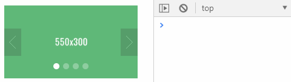

# 轮播图组件BannerPlugin

[TOC]

BannerPlugin轮播图组件使用原生JS编写，不依赖任何框架，可以独立使用。主要适用于跑马灯/轮播等交互场景。内置了多种轮播图切换方式，控件有多种样式选择。满足于绝大多数轮播图使用场景。如果你更特殊的使用需求，可以通过扩展接口进行修改。组件中也对全屏轮播做了功能尝试，可以简单胜任全屏轮播需求。

## 1、起步

引入css

```html
<link rel="stylesheet" href="../dist/banner.css">
```

引入JS

```html
<script src="../dist/banner-plugin.js"></script>
```

创建一个轮播图实例

```html
<div id='banner'></div>

<script>
	var banner=document.getElementById('banner');
    BannerPlugin({
        bannerBox:banner // 轮播图容器
    });
</script>
```


## 2、基本配置

### 2.1 轮播图尺寸

|    API    |    默认值    |   值类型    |    说明    |
| :-------: | :----------: | :---------: | :--------: |
| bannerBox | null（必填） | HTMLElement | 轮播图容器 |
|   width   | 550（必填）  |   Number    | 轮播图宽度 |
|  height   | 300（必填）  |   Number    | 轮播图高度 |
|  isFull   |    false     |   Boolean   |  是否全屏  |

使用示例：

> 创建一个800×300的轮播图


```javascript
var banner=document.getElementById('banner');
var bannerExample=BannerPlugin({
    bannerBox:banner,
    width:800,
    height:300,
    bannerData:[ // 后文会介绍如何配置轮播图数据
            {img:'http://placeholder.qiniudn.com/800x300/007AFF/fff'},
            {img:'http://placeholder.qiniudn.com/800x300/5FB878/fff'},
            {img:'http://placeholder.qiniudn.com/800x300/009688/fff'},
            {img:'http://placeholder.qiniudn.com/800x300/ff9500/fff'}
        ]
});
```

#### 全屏轮播

isFull是用来设置全屏轮播，默认为false，是我在写组件时的一个尝试，还需要改进。目前对上下轮播的全屏支持比较好。需要注意的是，在全屏模式下，宽度和高度的设置会失效。

使用示例：（手机端演示）


```javascript
var banner=document.getElementById('banner');
var bannerExample=BannerPlugin({
    bannerBox:banner,
    bannerType:'updown', // 轮播图轮播方式 updown：上下轮播
    arrowDisplay:'none', // 箭头按钮显示方式 none：不显示
    focusStyle:'dash',   // 指示器样式 dash：圆点
    isFull:true,         // 是否全屏
    bannerData:[
        {img:'http://placeholder.qiniudn.com/800x300/007AFF/fff'},
        {img:'http://placeholder.qiniudn.com/800x300/5FB878/fff'},
        {img:'http://placeholder.qiniudn.com/800x300/009688/fff'},
        {img:'http://placeholder.qiniudn.com/800x300/ff9500/fff'}
    ]
});
```

虽然我们使用的还是800×300的图片，但是是全屏显示的。为了让轮播图更美观，在上面的例子中对控件做了样式配置。这些配置项在后文中会介绍。

### 2.2 轮播图数据

|     API     |    默认值    |     值类型     |         说明         |
| :---------: | :----------: | :------------: | :------------------: |
| bannerData  | 数组（必填） |     Array      |      轮播图数据      |
|  haveDesc   |    false     |    Boolean     |   是否展示内容描述   |
|  haveLink   |     true     |    Boolean     |   是否添加转跳链接   |
| lazyImgTime |     200      | Number（毫秒） | 设置图片延迟加载时长 |

轮播图通过bannerData接收图片等数据。数据格式是固定的，格式如下：

```json
// bannerData
[
    {
        img:'xxx', // 图片地址
        link:'xxx',// 转跳链接
        desc:'xx'  // 内容描述(默认不展示)
    },
    {
        img:'xxx', // 图片地址
        link:'xxx',// 转跳链接
        desc:'xx'  // 内容描述(默认不展示)
    }
]
```

组件中内置了一组默认数据：

```javascript
bannerData: [
    {img:'http://placeholder.qiniudn.com/550x300/007AFF/fff'},
    {img:'http://placeholder.qiniudn.com/550x300/5FB878/fff'},
    {img:'http://placeholder.qiniudn.com/550x300/009688/fff'},
    {img:'http://placeholder.qiniudn.com/550x300/ff9500/fff'}
]
```

所以，可以直接使用：

```javascript
BannerPlugin({bannerBox:轮播图容器}); // 即可创建一个550×300的轮播图
```

你可以将自己的数据转换为上面的格式赋值给bannerData。

使用示例：


```javascript
var dataExample=[
    {
        "img":"http://placeholder.qiniudn.com/550x300/009688/fff",
        "desc": "那一天我二十一岁，在我一生的黄金时代。我有好多奢望。我想爱，想吃，还想再一瞬间变成天上半明半暗的云。",
        "link": "#"
    },
    {
        "img":"https://pic2.zhimg.com/v2-25261f93f94fabd84bd37aa34c2aea1a_1200x500.jpg",
        "desc": "静坐听雨无畏，无问西东求真。",
        "link": "https://movie.douban.com/subject/6874741/"
    },
    {
        "img":"http://placeholder.qiniudn.com/550x300/5FB878/fff",
        "desc": "岁月悠悠，衰微只及肌肤；热忱抛却，颓废必致灵魂。",
        "link": "#"
    },
    {
        "img":"http://placeholder.qiniudn.com/800x300/ff9500/fff",
        "desc": "我告诉你我懂什么。我每天到你家接你，我们出去喝酒笑闹,那很棒。但我一天中最棒的时刻，只有十秒，从停车到你家门口，每次我敲门,都希望你不在了。不说再见,什么都没有，你就走了",
        "link": "#"
    }
];
var banner=document.getElementById('banner');
var bannerExample=BannerPlugin({
    bannerBox:banner,       // 轮播图容器
    width:550,              // 轮播图宽度
    height:300,             // 轮播图高度
    bannerData:dataExample, // 轮播图数据
    haveDesc:true,          // 是否加载描述
    focusPosition:'outer'   // 指示器位置
});
```

**`haveDesc`是否添加描述**

如果你不想展示desc，可以把`haveDesc`设置为false，轮播图将不会加载该结构。默认情况下，`haveDesc`为false。你也可以让desc为空或者不提供desc数据。

**`haveLink`是否添加转跳链接**

在很多轮播图使用场景中，都会添加转跳链接，比如新闻和广告。在这里我们通过`haveLink`来控制，默认为true。如果不想添加转跳链接，设置false即可。

**`lazyImgTime`延迟加载时间**

为了提升用户体验，组件中的图片使用了延迟加载，如果没有正确获取图片，将以默认load图片代替。你可以个根据需要设置延迟加载时间。默认加载时间为200ms。

使用效果：


### 2.3 轮播方式

|    API     | 默认值  | 值类型 |         说明         |
| :--------: | :-----: | :----: | :------------------: |
| bannerType | default | String | 设置轮播图的切换方式 |

组件中提供了三种轮播图切换方式：

- default（左右切换，默认轮播方式）
- updown（上下切换）
- fade（渐隐渐现）

使用示例：


## 3、轮播控制

|     API      | 默认值 | 值类型  | 说明                                   |
| :----------: | :----: | :-----: | -------------------------------------- |
|  initIndex   |   0    | Number  | 初始索引，设置初始展示的图片           |
|    speed     |  300   | Number  | 切换速度，设置图片之间的切换速度       |
|    isAuto    |  true  | Boolean | 是否自动切换                           |
| autoInterval |  2000  | Number  | 自动切换的时间间隔                     |
| isMouseAuto  | false  | Boolean | 鼠标进入轮播图后，轮播图还是否自动切换 |
|  arrowEvent  | click  | String  | 切换箭头触发轮播图切换的事件           |
| focusControl |  true  | Boolean | 是否通过指示器（焦点）切换             |
|  focusEvent  | click  | String  | 指示器触发轮播图切换的事件             |

使用示例：

- initIndex用于设置默认展示图片，默认为0；

- isAuto用于设置轮播图是否自动切换，默认为true。


- speed用于设置轮播图切换动画的时间（请看下面动图中1和2轮播图对比）；

- autoInterval用于设置轮播图切换后，进行下一次切换的时间间隔（请看下面动图中2和3轮播图对比）；

- isMouseAuto用于设置鼠标进入轮播图后，轮播图还是否切换；


至于箭头按钮和指示器这些小控件对轮播图的切换控制，放在各自控件设置介绍中中进行演示说明。

## 4、箭头按钮设置

|     API      | 默认值 | 值类型 | 说明                                                         |
| :----------: | :----: | :----: | ------------------------------------------------------------ |
| arrowDisplay | always | String | 显示方式：`always`一直显示、`hidden`鼠标进入轮播图显示、`none`不显示 |
|  arrowEvent  | click  | String | 切换箭头触发轮播图切换的事件，默认点击按钮切换               |

使用示例：


## 5、指示器设置

|      API      | 默认值  | 值类型  | 说明                                                         |
| :-----------: | :-----: | :-----: | ------------------------------------------------------------ |
|  isfocusShow  |  true   | Boolean | 指示器是否显示，默认显示true                                 |
| focusPosition |  inner  | String  | 指示器在轮播图中的位置：inner内部、outer外部（对上下切换无效） |
|  focusStyle   | default | String  | 指示器样式：default、dash圆点、cycle圆环、square方形         |
| focusControl  |  true   | Boolean | 是否通过指示器切换图片                                       |
|  focusEvent   |  click  | String  | 设置指示器触发图片切换的事件                                 |


## 6、组件扩展

### extend方法

如果你对组件还有其他需求，可以通过通过extend方法进行扩展，在组件的原型上增加方法，或者重写原型上的方法。

| 参数 |  值   | 值类型  | 说明                                             |
| :--: | :---: | :-----: | ------------------------------------------------ |
| obj  | 对象  | Object  | 用于传递扩展的方法                               |
| deep | false | Boolean | 是否深度扩展，为true，则可以覆盖原型上的同名方法 |

extend方法是BannerPlugin的私有属性，不能在实例上使用。

使用示例：

将指示器的背景颜色变为红色。

```javascript
// 创建轮播图
var bannerExample=BannerPlugin({bannerBox:banner});

// 给轮播图组件的原型扩展changeColor方法
BannerPlugin.extend({
    changeColor:function(){
        this.focusBox.style.background="red";
    }
},false);

// 轮播图实例执行
bannerExample.changeColor();
```


在上面的例子中，focusBox就表示指示器容器。你在初次使用时，可能不熟悉。这个组件的源代码非常简单，你完全可以通过研究源代码和查看dom结构去了解。其实，我们也可以自己在原型上扩展一个函数筛选出我们需要的数据。

首先，我们通过`console.dir(bannerExample)`打印这个轮播图实例，可以看到数据都存在私有属性上,我们过滤掉Number、String、Boolean类型的属性，还剩下的就是dom结构和轮播图数据属性。

扩展示例：

```javascript
BannerPlugin.extend({
    getData:function(){
        var result={};
        for( key in this){
            if(this.hasOwnProperty(key)){
                var type=Object.prototype.toString.call(this[key]);
                var reg=/\[object (Number|String|Boolean)\]/;
                if(!reg.test(type)){
                    result[key]=this[key];
                }
            }

        }
        return result;
    }
});
var data=bannerExample.getData();
```


## 7、组件注销

### destory方法

轮播图注销，组件完成生命周期后，可以通过组件原型上的destroy方法进行销毁。

使用示例：

```javascript
var bannerExample=BannerPlugin({...});
bannerExample.destroty();                                
```



## API汇总

### [尺寸]

- 轮播图容器 bannerBox
- 轮播图宽度 width
- 轮播图高度 height
- 全屏切换isFull（false/true）

### [数据]

- bannerData
  - 图片地址img
  - 描述 desc
  - 转跳链接 link
- 是否需要描述 havedesc （默认无false）
- 图片延迟加载时间lazyImgTime

### [轮播控制]

- 轮播方式bannerType
  - 左右切换 default
  - 上下切换 updown
  - 渐隐渐现 fade
- 初始索引 initIndex
- 切换速度 speed
- 是否自动切换 isAuto
- 自动切换时间间隔 autoInterval
- 鼠标进入是否切换 isMouseAuto
- 触发左右按钮切换的事件 arrowEvent
- 是否通过焦点切换 isFocusChange
- 触发焦点切换的事件 focusEvent
- 是否需要描述 havedesc （默认无false）

### [切换按钮]

- 显示方式 arrowDisplay
  - 一直显示 always
  - 鼠标进入显示 hidden
  - 不显示 none
- 触发左右按钮切换的事件 arrowEvent

### [指示器]

- 显示 isfocusShow
  - 显示 true
  - 不显示 false

- 位置 focusPosition
  - 内部 inner
  - 外部 outer
- 样式focusStyle
  - 默认 default（默认有边框）
  - 圆点 dash
  - 圆环 cycle
  - 方形 square
- 是否通过焦点切换 isFocusChange
- 触发焦点切换的事件 focusEvent

### [注销]

- destroy方法


