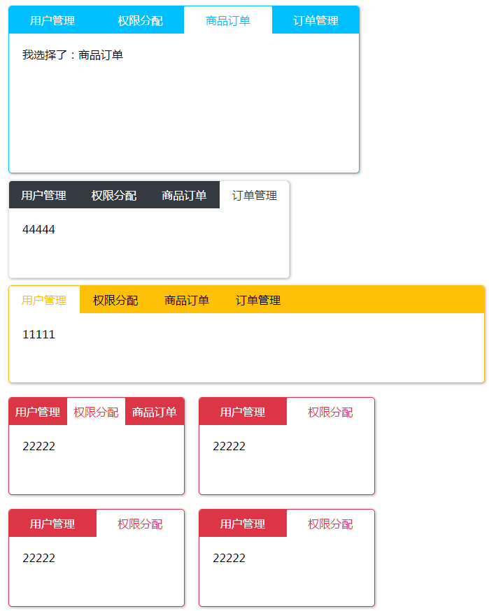
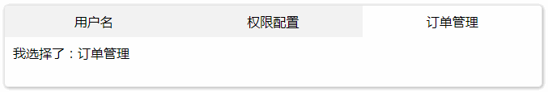

# SwitchTab选项卡面板独立组件

`v0.0.1`

switchTab选项卡面板提供多套风格，支持响应式，支持自定义样式，支持自定义事件触发等功能。switchTab选项卡独立组件使用原生JS编写，不依赖任何框架。



## 1、起步

导入CSS

```html
<link rel="stylesheet" href="../dist/tab.css">
```

导入JS

```html
<script src="../dist/tab.js"></script>
```

选项卡基本结构

```html
<div class="tabBox">
    <ul class="tabBox-tab">
        <li class="tabBox-tabTag">用户名</li>
        <li class="tabBox-tabTag">权限配置</li>
        <li class="tabBox-tabTag">订单管理</li>
    </ul>
    <div class="tabBox-con">
        <div class="tabBox-conTag">11111</div>
        <div class="tabBox-conTag">22222</div>
        <div class="tabBox-conTag">333</div>
    </div>
</div>
```

使用：

```javascript
// 选择选项卡容器
var tabBox=document.getElementsByClassName("tabBox")[0];

// 初始化选项卡
new SwitchTab(tabBox);
```


## 2、选项卡设置

```javascript
new SwitchTab(container,options);
```

我们通过new SwitchTab实例来初始化选项卡，SwitchTab构造函数有两个参数,第一个参数为选项卡容器，第二个参数为操作对象。我们的api就是options的属性。

|          API          | 默认值 |   类型   | 说明                                                         |
| :-------------------: | :----: | :------: | :----------------------------------------------------------- |
|       initIndex       |   0    |  Number  | 选项卡默认选中标签                                           |
|       isJustify       | false  | Boolean  | 选项卡标签是否两端对齐                                       |
|       eventType       | click  |  String  | 选项卡切换需要触发事件                                       |
| fun(tagItem，conItem) |  null  | Function | 选择当前标签时，触发fun回调函数，自动传入参数：tagItem当前选中的标签，conItem当前标签页面 |

### 使用示例：

```html
<div class="tabBox">
    <ul class="tabBox-tab">
        <li class="tabBox-tabTag">用户名</li>
        <li class="tabBox-tabTag">权限配置</li>
        <li class="tabBox-tabTag">订单管理</li>
    </ul>
    <div class="tabBox-con">
        <div class="tabBox-conTag">11111</div>
        <div class="tabBox-conTag">22222</div>
        <div class="tabBox-conTag">333</div>
    </div>
</div>

<script>
var tabBox=document.getElementsByClassName("tabBox")[0];

new SwitchTab(tabBox，{
	initIndex:2,
    isJustify:true,
	eventType:"mouseover",
    fun:function(tagItem,conItem){
    	conItem.innerHTML="我选择了："+tagItem.innerHTML;
	}        
});
</script>
```



## 3、内置风格选择

|  API  | 默认值  |  类型  |        说明        |
| :---: | :-----: | :----: | :----------------: |
| style | default | String | 设置选项卡样式风格 |

总共内置了8中样式风格，采用的是Bootstrap4中的配色。颜色如下：（使用时，首字母小写）


### 使用示例：

```javascript
new SwitchTab(tabBox，{style:"dark"});
```


```javascript
new SwitchTab(tabBox，{style:"danger"});
```


## 4、自定义样式

如果内置的风格样式不满足需求，我们还可以自定义样式。

|      API       | 默认值 |  类型  | 说明                                      |
| :------------: | :----: | :----: | ----------------------------------------- |
|     width      |  null  | Number | 设置选项卡容器的宽度                      |
|     height     |  100   | Number | 设置选项卡容器的高度                      |
|  tabBoxStyle   |  null  | Object | 设置选项卡容器样式                        |
|  tagBoxStyle   |  null  | Object | 设置标签容器样式（不要和tabBoxStyle混淆） |
|  conBoxStyle   |  null  | Object | 设置标签页容器样式                        |
|    tagStyle    |  null  | Object | 设置标签样式                              |
| tagActiveStyle |  null  | Object | 设置标签激活样式                          |
|    conStyle    |  null  | Object | 设置标签页样式                            |

width和height是用来快速设置选项卡容器大小的api，除了用这两个设置外，还可以在tabBoxStyle对象里面设置宽高及其他各种样式。

### 使用示例：


```javascript
new SwitchTab(tabBox,{
    // 设置选项卡容器大小
	width:500,
	height:150,
    // 设置选项卡容器样式
	tabBoxStyle:{
		overflow:"visible",
		margin:20
	},
    // 设置选项卡标签容器样式
	tagBoxStyle:{
		backgroundColor:"#6DDEEE"
	},
    // 设置选项卡标签样式
	tagStyle:{
		color:"white",
		backgroundColor:"#6DDEEE",
		height:38,
		top:0
	},
    // 设置选项卡标签页容器样式
	conBoxStyle:{
		backgroundColor:"#555F61",
		color:"white"
	},
    // 设置选项卡标签激活样式
	tagActiveStyle:{
		backgroundColor:"#555F61",
		color:"#6DDEEE",
		height:48,
		position:"relative",
		top:-10
	}
});
```

## 完成清单

- [x] 样式自定义

- [x] 设置初始选择标签

- [x] 内置选项卡风格

- [x] 回调函数

  - [x] 可扩充选中提示（用户自定义）
  - [x] 动态绑定数据（可通过ajax获取数据，用fun回调函数绑定数据）

- [ ] 选项卡自动轮播

- [ ] 动态添删标签

- [ ] 冻结标签（标签不可选）

- [ ] 选项卡多风格

  - [x] 面板风格
  - [ ] 简约风格（轮廓线）

- [ ] 移动端响应式支持


